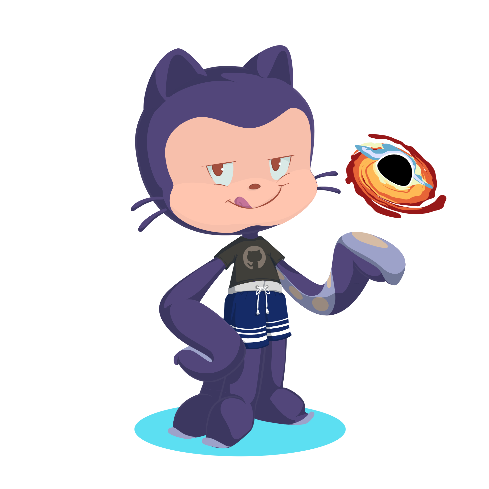

## Olá, sou o Allan, um estudante de tecnologia!

  - 🌱- Sou um estudante de tecnologia
  - 🪐- Acadêmico em tecnologia da informação - UFERSA
  - 🎓- Atualente no meu 7° período
  - ☕- Futuro engenheiro da software
  - 💻- Apaixonado por tecnologia 
  
  ##
  
  

      
    
       
     
    
    
    
    
     
  

  
  ##

  Minhas IDEs e sistemas atuais: 
  

     
      
      
  

  
  ##

  Linguagens que desejo aprender:

    
   
   ##
  
  

  
  
   

##

 
